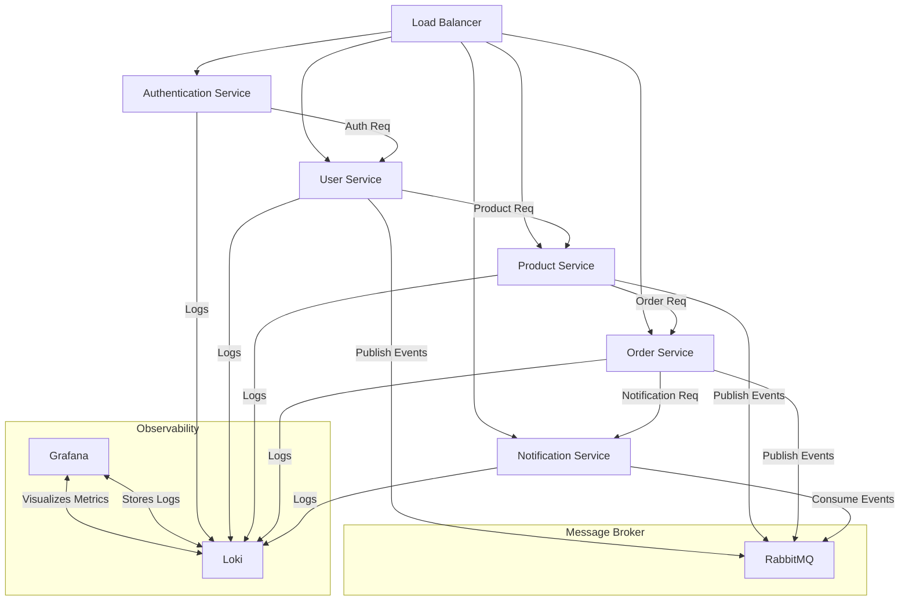

# Microservices Architecture Project

This repository showcases a comprehensive Microservices Architecture project that integrates various technologies to create a scalable and modular system. The project includes a Load Balancer, Authentication Service, User Service, Django Service, and a Java Service. Below is an overview of each component and the technology stack used.

## Project Overview

The system is designed to demonstrate how different microservices can work together in a distributed environment. Each service is responsible for a specific functionality and communicates with other services through HTTP requests.

## Technology Stack
---

### Load Balancer :traffic_light:

- **Language:** Go
- **Description:** Handles incoming requests and distributes them to the appropriate service. Implements load balancing and request forwarding.

<p align="center">
  <a href="https://skillicons.dev">
    
  </a>
</p>

---

### Authentication Service :lock:

- **Language:** Go
- **Description:** Manages user authentication, including registration and login functionalities. Secures endpoints and manages user sessions.
<p align="center">
  <a href="https://skillicons.dev">
    
  </a>
</p>

---

### User Service :busts_in_silhouette:


- **Language:** Node.js
- **Framework:** Express
- **Database:** MySQL (via Sequelize)
- **Description:** Manages user data and profiles. Provides RESTful APIs to interact with user information.
<p align="center">
  <a href="https://skillicons.dev">
    
  </a>
</p>

---

### Product Service :package:


- **Language:** Python
- **Framework:** Django
- **Description:** Provides additional functionalities and serves specific business logic. Implements a RESTful API to interact with external services.
<p align="center">
  <a href="https://skillicons.dev">
    
  </a>
</p>

---

### Order Service :shopping_cart:


- **Language:** Java
- **Framework:** Spring Boot
- **Description:** Handles various business processes and provides a RESTful API for communication with other services.
<p align="center">
  <a href="https://skillicons.dev">
    
  </a>
</p>

---

### Notifications Service :bell:


- **Language:** Node.js
- **Framework:** Express.js
- **Description:** A future service for handling notifications, to be implemented with Node.js and Express.

<p align="center">
  <a href="https://skillicons.dev">
    
  </a>
</p>

---
## Additional Services
### RabbitMQ :rabbit2:
<p align="left">
  <a href="https://skillicons.dev">
    
  </a>
</p>
RabbitMQ is a message broker that facilitates communication between different microservices through asynchronous messaging and queuing. In this project, RabbitMQ is set up to handle messaging and task queuing, ensuring reliable communication and efficient processing of tasks between services. It helps decouple the services and manage the message flow effectively.

### Grafana :bar_chart:
<p align="left">
  <a href="https://skillicons.dev">
    
  </a>
</p>
- Grafana is an open-source platform for monitoring and observability. It allows you to create interactive and visually appealing dashboards to track metrics and logs from various services. In this project, Grafana will be used to visualize performance metrics and system health across the microservices. It provides insights into the operation and performance of the system, enabling proactive monitoring and troubleshooting.

### Loki :file_folder:
- Loki is a log aggregation system that integrates seamlessly with Grafana. It is designed for storing and querying logs from multiple sources. In this project, Loki will be used to collect and manage logs from all microservices. This enables you to correlate logs with metrics in Grafana, making it easier to troubleshoot issues and gain a comprehensive view of system activity.
<p align="left">
  <a href="https://skillicons.dev">
    
  </a>
</p>

---

## Getting Started ▶️ 
1. **Clone the Repository**

```sh
git clone https://github.com/manuelfirman/msa-ecosystem.git
cd msa-ecosystem
```

2. **Configure Environment Variables**
- Review the `.env_example` and `env_example.sh` files.
- Set up your environment variables accordingly by creating a `.env` file or exporting the variables from `env_example.sh`.

3. **Set Up Docker Containers**
- Ensure Docker and Docker Compose are installed.
- Build and start the containers.
```sh
docker-compose up --build
```

---

