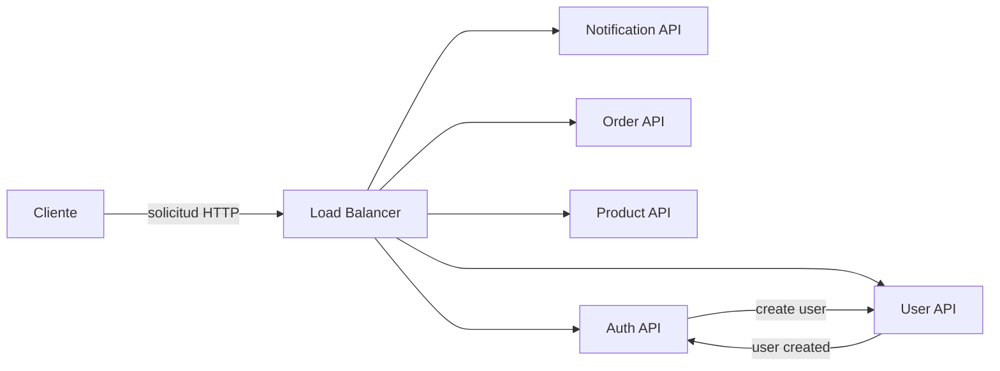

Paso 2: Configurar y Probar Cada Dockerfile Individualmente
Asegúrate de que cada Dockerfile esté correctamente configurado y de que los servicios se construyan y se ejecuten sin problemas. Puedes hacerlo ejecutando los siguientes comandos en cada directorio de servicio:

```sh
# buildeo manual
docker build -t <nombre-del-servicio> .
# prubea de buildeo manual
docker run -p <puerto>:<puerto> <nombre-del-servicio>


# buildear y levantar el docker-compose y sus imagenes
docker-compose up --build
```


